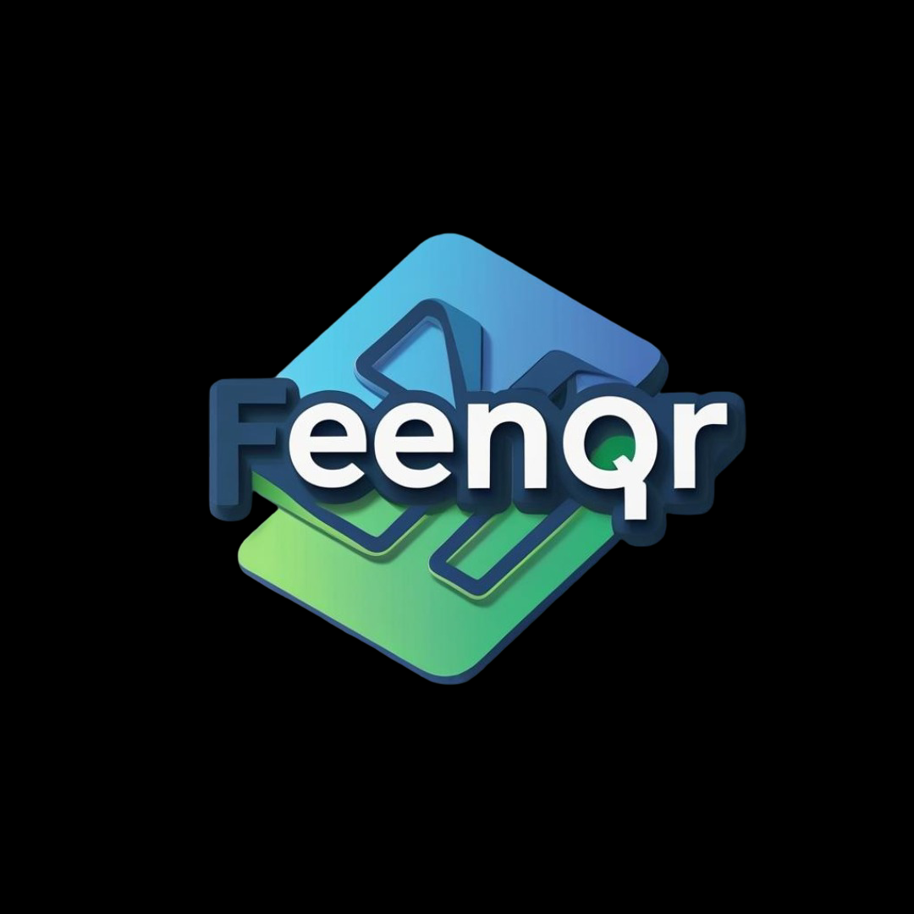

We are a multidisciplinary team of mathematicians, statisticians, and theoretical computer scientists developing quantitative strategies to identify and exploit opportunities across global financial markets. We combine rigorous mathematical modeling with cutting-edge technology, while deploying proprietary capital

## Tech Stack

  &nbsp;
  &nbsp;      
  &nbsp;
  &nbsp;
  &nbsp;
  &nbsp;
  &nbsp;
  &nbsp;
  &nbsp;
  &nbsp;
  &nbsp;
  

## Our Open Source deployed Tools 

