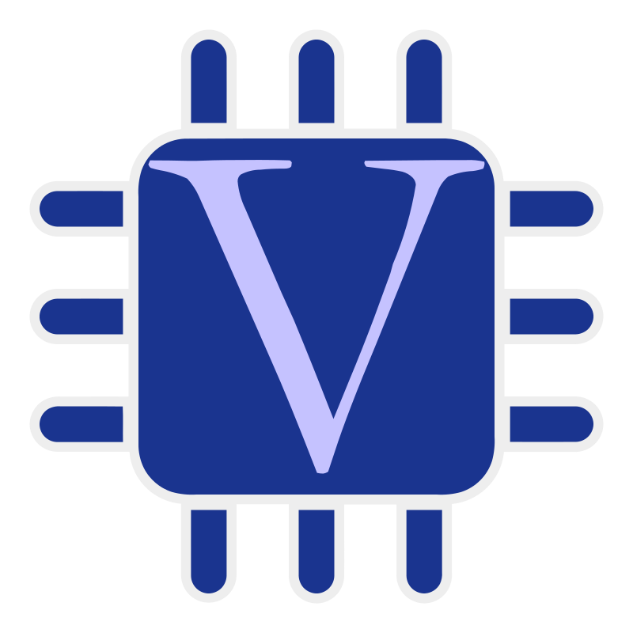
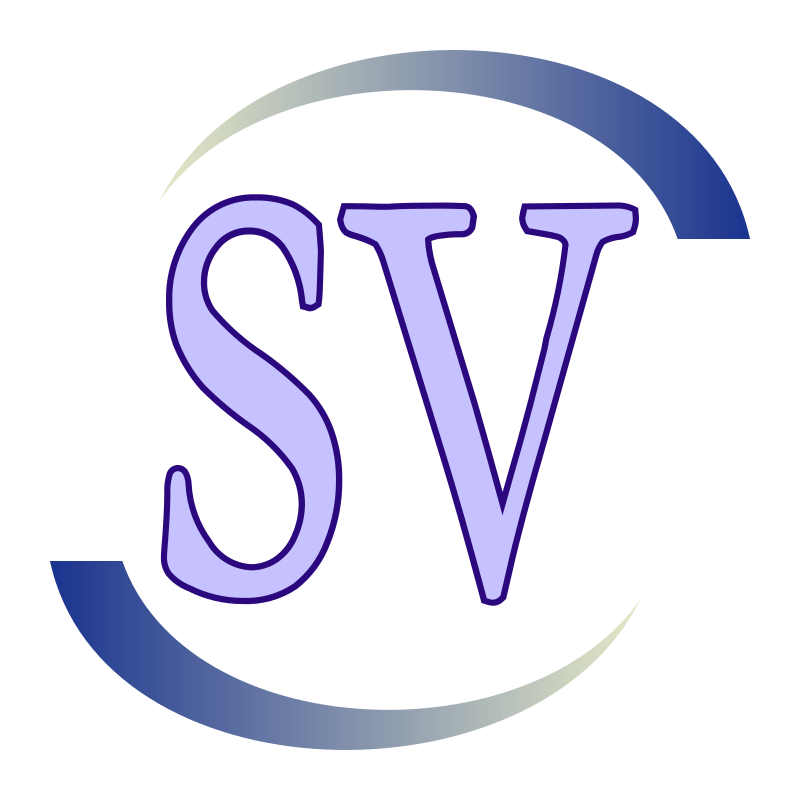
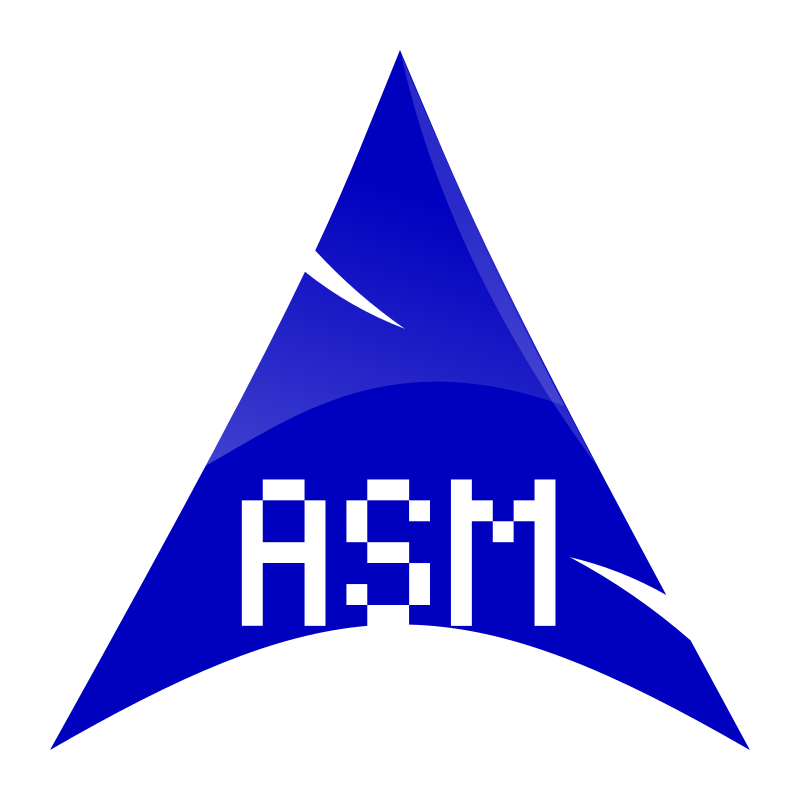
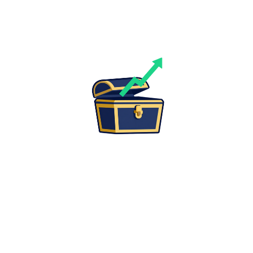

## 𝗜𝗻𝘁𝗿𝗼𝗱𝘂𝗰𝘁𝗶𝗼𝗻

𝗪𝗲 𝗮𝗿𝗲 𝗮 𝗺𝘂𝗹𝘁𝗶𝗱𝗶𝘀𝗰𝗶𝗽𝗹𝗶𝗻𝗮𝗿𝘆 𝘁𝗲𝗮𝗺 𝗼𝗳 𝗺𝗮𝘁𝗵𝗲𝗺𝗮𝘁𝗶𝗰𝗶𝗮𝗻𝘀, 𝘀𝘁𝗮𝘁𝗶𝘀𝘁𝗶𝗰𝗶𝗮𝗻𝘀, 𝗮𝗻𝗱 𝘁𝗵𝗲𝗼𝗿𝗲𝘁𝗶𝗰𝗮𝗹 𝗰𝗼𝗺𝗽𝘂𝘁𝗲𝗿 𝘀𝗰𝗶𝗲𝗻𝘁𝗶𝘀𝘁𝘀 𝗱𝗲𝘃𝗲𝗹𝗼𝗽𝗶𝗻𝗴 𝗾𝘂𝗮𝗻𝘁𝗶𝘁𝗮𝘁𝗶𝘃𝗲 𝘀𝘁𝗿𝗮𝘁𝗲𝗴𝗶𝗲𝘀 𝘁𝗼 𝗶𝗱𝗲𝗻𝘁𝗶𝗳𝘆 𝗮𝗻𝗱 𝗲𝘅𝗽𝗹𝗼𝗶𝘁 𝗼𝗽𝗽𝗼𝗿𝘁𝘂𝗻𝗶𝘁𝗶𝗲𝘀 𝗮𝗰𝗿𝗼𝘀𝘀 𝗴𝗹𝗼𝗯𝗮𝗹 𝗳𝗶𝗻𝗮𝗻𝗰𝗶𝗮𝗹 𝗺𝗮𝗿𝗸𝗲𝘁𝘀. 𝗪𝗲 𝗰𝗼𝗺𝗯𝗶𝗻𝗲 𝗿𝗶𝗴𝗼𝗿𝗼𝘂𝘀 𝗺𝗮𝘁𝗵𝗲𝗺𝗮𝘁𝗶𝗰𝗮𝗹 𝗺𝗼𝗱𝗲𝗹𝗶𝗻𝗴 𝘄𝗶𝘁𝗵 𝗰𝘂𝘁𝘁𝗶𝗻𝗴-𝗲𝗱𝗴𝗲 𝘁𝗲𝗰𝗵𝗻𝗼𝗹𝗼𝗴𝘆, 𝘄𝗵𝗶𝗹𝗲 𝗱𝗲𝗽𝗹𝗼𝘆𝗶𝗻𝗴 𝗽𝗿𝗼𝗽𝗿𝗶𝗲𝘁𝗮𝗿𝘆 𝗰𝗮𝗽𝗶𝘁𝗮𝗹.

## 𝗧𝗲𝗰𝗵 𝗦𝘁𝗮𝗰𝗸

  &nbsp;
  &nbsp;      
  &nbsp;
  &nbsp;
  &nbsp;
  &nbsp;
  &nbsp;
  &nbsp;
  &nbsp;
  &nbsp;
  

## 𝗢𝘂𝗿 𝗢𝗽𝗲𝗻 𝗦𝗼𝘂𝗿𝗰𝗲 𝗗𝗲𝗽𝗹𝗼𝘆𝗲𝗱 𝗧𝗼𝗼𝗹𝘀 

